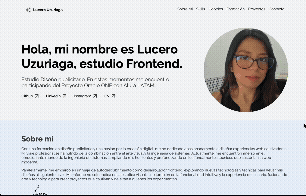

# Portafolio — Proyecto estático

Pequeño portafolio estático que contiene una página principal, estilos y scripts.



## Descripción

Este repositorio contiene una página web de portafolio simple (HTML/CSS/JS) que puedes abrir localmente para revisar el diseño y la interactividad.

Contenido principal:
- `index.html` — Página principal.
- `javaScript.js` — Lógica JavaScript del sitio.
- `css/` — Estilos del proyecto:
  - `reset.css` — Reset de estilos base.
  - `styles.css` — Estilos personalizados.
- `img/` — Carpeta con imágenes del portafolio.

## Estructura de archivos

```
/ (raíz)
├─ index.html
├─ javaScript.js
├─ css/
│  ├─ reset.css
│  └─ styles.css
└─ img/
```

## Tecnologías


- HTML5
- CSS3
- JavaScript (vanilla)

No hay dependencias externas ni compilación necesaria.

## 🚀 Características

- Diseño responsive adaptable a diferentes dispositivos.  
- Estructura clara y moderna.  
- Animaciones y efectos suaves.  
- Código limpio y organizado.  
- Fácil de mantener y actualizar.


## Licencia
Consulta el archivo LICENSE para más detalles.


🧑‍💻 Autor

Desarrollado por Tu Nombre
💌 Contáctame para colaborar en proyectos web.
